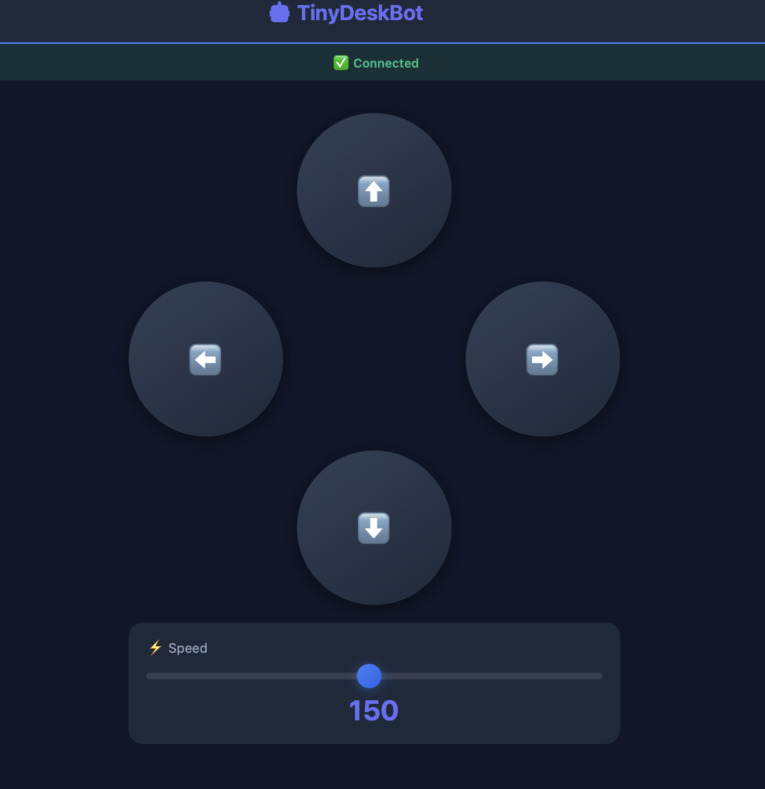
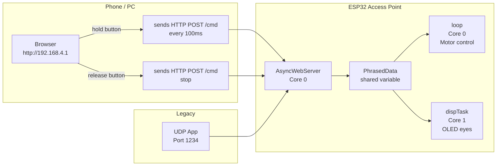

# Fork Changes & New Features

This fork extends the original [Tiny Desktop Robot](https://www.instructables.com/Tiny-Desktop-Robot-With-ESP32-and-FreeRTOS/) with the following additions.

---

## PlatformIO Support

The project can now be built and uploaded using [PlatformIO](https://platformio.org/) instead of the Arduino IDE.

**Setup:**
1. Open the root folder in VS Code with the PlatformIO extension installed
2. Run `pio run --target upload` to build and flash

The `platformio.ini` at the project root handles all dependencies automatically.

---

## Mobile Web Controller

The ESP32 now runs as a **WiFi Access Point** and hosts a mobile-friendly web interface.

**How to use:**
1. Flash the firmware
2. Connect your phone or PC to the WiFi network `LittleBoi_Robot` (password: `huiweimaev`)
3. Open a browser and go to `http://192.168.4.1`

**Web Interface:**

> *Screenshot of the mobile web controller running in a browser*

**Features:**
- Directional control buttons (forward / backward / left / right) arranged as a cross
- Hold a button to keep moving — release to stop
- Speed slider (50–255)
- Optional log panel showing sent commands and responses

**Control Flow:**

**Control still works via UDP** on port `1234` (original app remains compatible).

---

## Files Added

| File | Description |
|---|---|
| `mobile_html.h` | HTML/CSS/JS for the web controller, served from PROGMEM |
| `platformio.ini` | PlatformIO build configuration |
